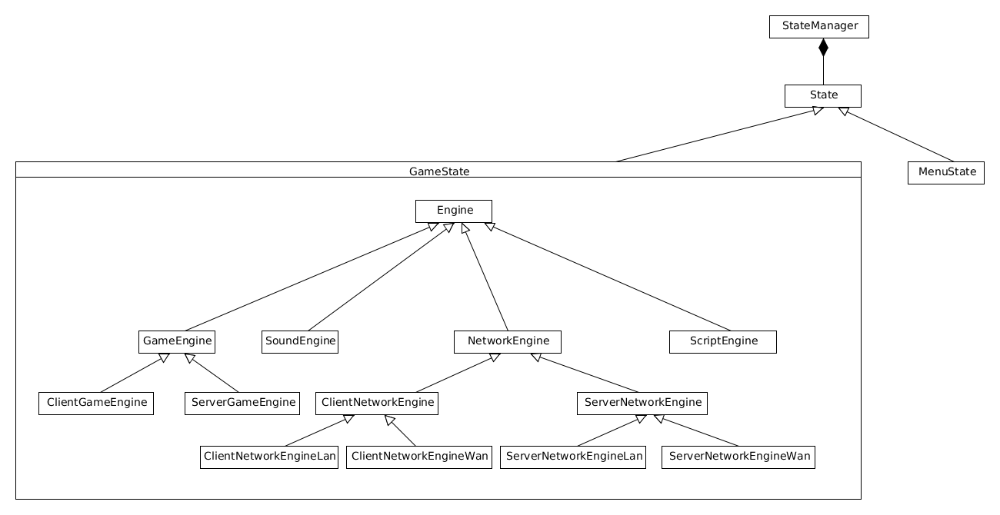
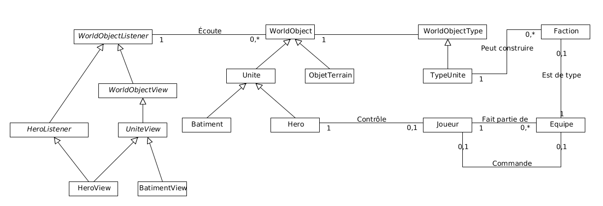

class: center, middle
# MeteorFalls
---
#Sommaire

* Présentation générale du projet
* L'équipe
* Objectifs
* Choix Techniques
* Schémas général simplifié de l'architecture
* Schéma général simplifié de la logique de jeu
* Conclusion

---

# Présentation générale du projet

* Jeu multijoueurs
* Plusieurs équipes s'affrontent
* Chaque équipe est composée:
  * D'un commandant
  * De héros
* Environnement
  * Fantastique
  * Post-apocalyptique
  * Science-fiction
---

# L'équipe

À l'origine, l'équipe était composée par:
* Fabrice Bats
* Bastien Chevriaut
* Alexandre Ramel
* Thomas Loubiou
* Antoine Rose

---

# Objectifs
* Objectifs principaux
 * Organisation générale d'un jeu
 * Utilisation de technologies 3D
 * Meilleur compréhension des problématiques liées au jeux vidéo 
 * Apprendre à utiliser les shaders plus en profondeur
 * Travailler sur l'IA des unités, voire une IA de commandant
* Objetcifs secondaires
 * Obtenir un Proof Of Concept présentable (concours par exemples)
 * Travailler sur la génération aléatoire de terrains jouables

---

# Choix Techniques

--
### Au niveau technologies

* C++
* Boost (Asio, Property Tree, Threads, …)
* Ogre 3D + SkyX, Hydrax, Paged Geometry
* CEGUI
* Lua
* Bullet Physics

--

### Au niveau architecture

* Utilisation d'un serveur global
* Modèle orienté objet
* Architecture Modéle/Vue
* Architecture réseau gouvernée par le serveur…
* Soutenue par le client pour fluidifier l'expérience du joueur

---

# Schémas général simplifié de l'architecture

---

# Schéma général simplifié de la logique de jeu

---

# Quelques difficultés rencontrées

* Synchronisation d'un moteur physique sur le réseau
* Découplage de la création d'interface du reste du code
* Utiliser le plus de code commun possible entre le client et le serveur
* Pouvoir protéger l'accès à un serveur avec un mot de passe
* Comment bien gérer le réseau, afin de pouvoir fonctionner dans des conditions variées
* Comment gérer les différents états de jeu ?
* Comment gérer différentes architectures machines sur le réseau ?

---

# Conclusion
Si nous devions refaire ce projet en recommençant tout, avec pour objectif un jeu fonctionnel nous utiliserions un moteur de jeu.

En concervant les mêmes objectifs, mais avec plus de temps, nous obterions pour des technologies similaires.

